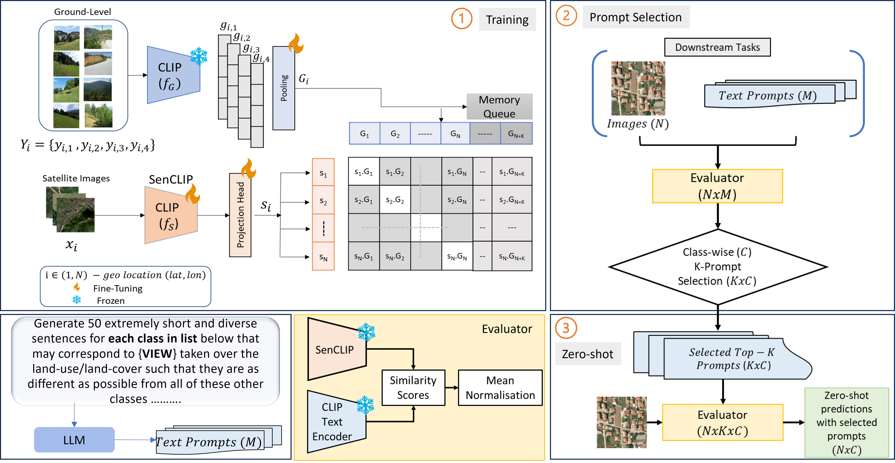

# SenCLIP: Enhancing zero-shot land-use mapping for Sentinel-2 with ground-level prompting
Official implementation of the paper **SenCLIP: Enhancing zero-shot land-use mapping for Sentinel-2 with ground-level prompting**, a vision-language framework that adapts **CLIP** for zero-shot land-use/land-cover (LULC) mapping with Sentinel-2 imagery. Pre-trained models like CLIP excel at zero-shot tasks but struggle with satellite imagery due to limited representation in their training data.  

SenCLIP addresses this gap by aligning Sentinel-2 satellite images with geotagged [LUCAS 2018](https://ec.europa.eu/eurostat/web/lucas/database/2018) ground-level photos, enabling the model to understand detailed ground-view descriptions. Evaluated on EuroSAT and BigEarthNet, SenCLIP significantly improves LULC classification accuracy using both aerial and ground-level prompts, advancing the use of vision-language models for medium-resolution satellite imagery.

[Accepted at WACV'25.]

[Model Checkpoints 🤗 ](https://huggingface.co/pallavijainpj/SenCLIP)

[Sentinel-2 Dataset]

# Model Architecture

# Dataset and Checkpoints
We obtained geotagged Sentinel-2 data from the LUCAS 2018 dataset, consisting of 100x100 pixel images with three spectral bands (RGB). Data was retrieved using the [Planetary Computers API](https://planetarycomputer.microsoft.com/docs/quickstarts/reading-stac/), focusing on the same months as the LUCAS data. To ensure minimal cloud interference (10-20% cloud coverage), the collection window was extended by up to ±2 months based on the availability of cloud-free images.

We have released four model checkpoints, covering both RN50 and ViT-B/32 architectures, with variants for average pooling and attention pooling.
